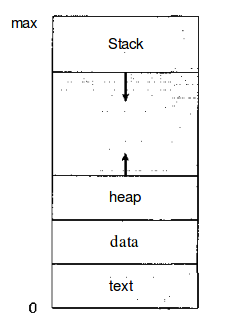
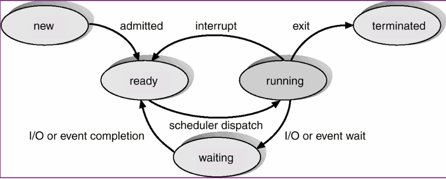

Process concept
================

#### 1. **The process**
A process is a program in execution. It is presented by the value of the **program counter** (PC) and the contents of the processor's **registers**. A process generally includes a **stack** which contains temporatory data (function parameters, return addresses, local variables) and a **data section** which includes globals variables. A process may includes a **heap**, which is dynamically allocated memory appearing during process runtime.  
  
A process is not a program. While a program, as a passive entity, only contains a list of instructions stored on dish, a process, regarded as an active entity, contains a PC specifying the next instruction to execute and a set of resources specifying the state of the running program. A program becomes a process when their executed file is loaded into memory.  
#### 2. **Process states**
When a process executes, it changes its state. The state of a process is definded in part by the process's current activity. Every process may be in one of five follow states:
* New: The process is being created
* Running: Process's instructions are being executed
* Waiting: The process is waiting for some events to occur
* Ready: The process is waiting to be assigned to a processor
* Terminated: The process has finished execution.  

Those state names are arbitrary and they vary across operating systems. Certain operating system also more finely delineate process states. However, in every operating system, there is only one process can be running on any processor at any instant. Many processes can be ready or waiting, however.  
  
### 3. **Process Control Block**
A process is represented in operating sytem as a **Process Control Block** (PCB). Each PCP contains many pieces of information associated with the process it presents, including these:  
* Process state: The state may be new, running, waiting, halted,...
* Program counter: The couter indicates the address of the next instruction to be executed
* CPU registers: The registers vary in number and type, depending on computer architecture. They include accumulators, index registers, stack pointers and general purpose registers. Along with Program Pointer, the registers' states will be saved somewhere when the process is interrupted, in order to be reloaded again when the process continues running.
* CPU scheduling information: 
